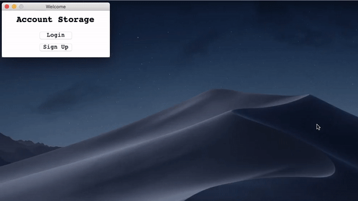

# Account Storage GUI  

[](https://www.python.org/)

[](https://www.python.org/downloads/release/python-380/)

[](https://github.com/AkashSDas)

[](https://github.com/AkashSDas)

[](LICENSE)

  
  

## Table of contents

  

*  [About](#about)

* [Technologies Used](#technologies-used)

*  [Installation](#installation)

*  [License](#license)

  
  

## About

> A simple GUI that allows you to save your accounts and their respective passwords.

> Since it's hard to remember all the passwords that we use. It's good to remember one password rather than remembering 10's and 100's of passwords. `Account Storage GUI` solves this major problem.

 >This GUI app has an authentication where user can `login` and `signup`, so now you have to remember one password only.

> The accounts and their respective  passwords that user wants to save are saved in a `database` where accounts are saved as it is and their the passwords are stored in the `hashed` form.



## Technologies Used

> [](https://www.python.org/downloads/release/python-380/) is used as Programming Language.

> Using Python modules such as `Tkinter` and `sqlite3` to make `Account Storage GUI`.

> This GUI has an `authentication` system where users can`login` and `signup`.

> Since it's an account storage so user's can store their accounts and their respective passwords. This accounts and their respective `hashed passwords`  are saved in a database file which made using `sqlite3` where `context manager` to manage resources(database).


## Installation


#### With out using virtual-environment

`If you are just intersted in the GUI's script and the database file then follow the below instructions.`

- First, start by closing the repository
```bash

git clone https://github.com/AkashSDas/Accounts-Storage-GUI

```
- Go to the `src` folder
```bash
cd  Accounts-Storage-GUI/venv/src/
```

In folder `Accounts-Storage-GUI/venv/src/` there is `main.py` which is the GUI's script and `database.db` which is the database file.

* To start the `GUI` do
```bash
python main.py
```


##### If you don't want to use virtual-environment then no need to proceed further since now you have the database file as well as the GUI script.

#### With using virtual-environment

>It is  **recommended** to use **`virtual enviroment`** for this project to avoid any issues related to dependencies.
 
Here **`pipenv`** is used for this project.

- First, start by closing the repository
```bash
git clone https://github.com/AkashSDas/Accounts-Storage-GUI
```

- Start by installing **`pipenv`** if you don't have it
```bash
pip install pipenv
```

- Once installed, access the venv folder inside the project folder

```bash
cd  'Accounts-Storage-GUI'/venv/
```

- Create the virtual environment

```bash
pipenv install
```

The **Pipfile** of the project must be for creating replicating project's virtual enviroment.

This will install all the dependencies and create a **Pipfile.lock** (this should not be altered).

 
- Enable the virtual environment

```bash
pipenv shell
```

* The `GUI` script and `database` file are in `src` folder
```bash
cd src/
```
* To start the `GUI` do
```bash
python main.py
```


## License

  

This project is licensed under the MIT License - see the [MIT LICENSE](LICENSE) file for details.
